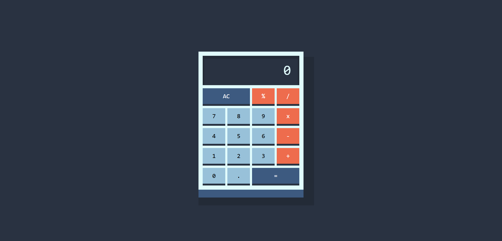

# Calculator

Calculator made with HTML, CSS, and JavaScript. 

# Index

- [Overview](#overview)
- [My Process](#my-process)
  - [Built with](#built-with)
  - [What I learned](#what-i-learned)
- [Author](#author)

&nbsp;

# Overview

This Calculator allows you to perform basic arithmetic operations such as addition, subtraction, multiplication, and division.

&nbsp;

# My Process

## Built with :

- [HTML](https://developer.mozilla.org/es/docs/Web/HTML)
  - Structure of the calculator
- [CSS](https://developer.mozilla.org/es/docs/Web/CSS)
  - Styling the calculator
- [JavaScript](https://developer.mozilla.org/es/docs/Web/JavaScript)
  - Functionality and interactivity

&nbsp;

## What I learned :

- Improved my skills in building interactive web applications with JavaScript.
- Enhanced my understanding of CSS for styling user interfaces.
- Gained experience in structuring HTML for a functional web app.

&nbsp;

# Author

- Website - [IgnaciioDev](https://ignaciiodev.github.io/portfolio2024/) 
- Github - [IgnaciioDev](https://github.com/IgnaciioDev) 
- LinkedIn - [IgnaciioDev](https://www.linkedin.com/in/ignaciodev/) 

